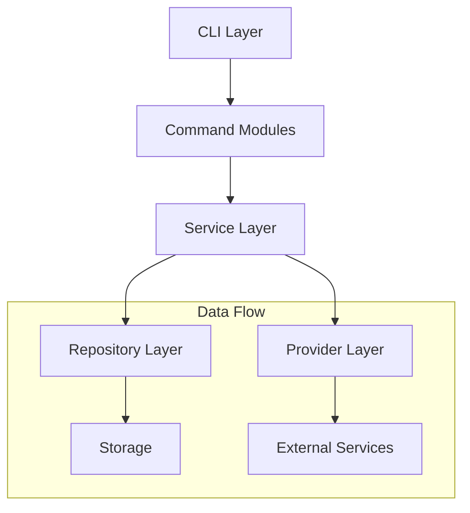
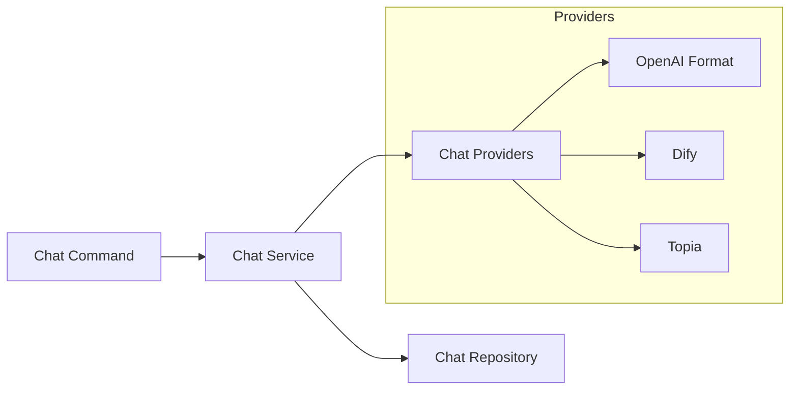
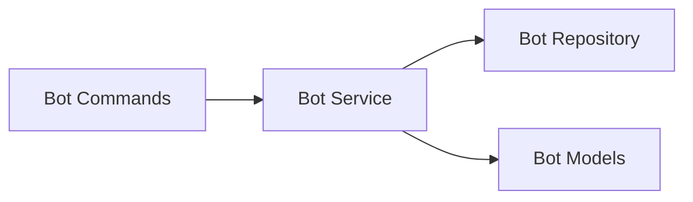
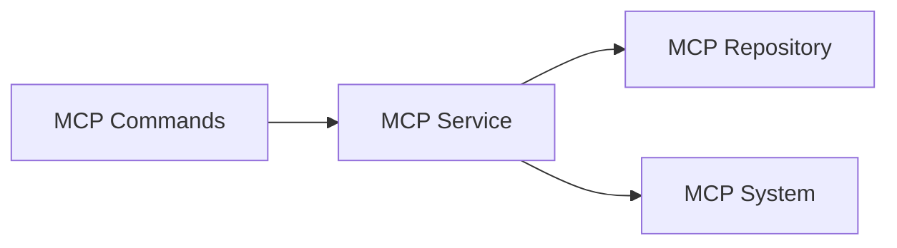

# System Patterns: y-cli

## Architecture Overview

### Core Components

## Design Patterns

### Repository Pattern
- Used for data persistence and retrieval
- Implemented in bot.repository, chat.repository, mcp_server.repository
- Abstracts storage operations from business logic
- Enables future storage backend changes

### Service Layer Pattern
- Business logic encapsulation
- Service classes in bot.service, chat.service, mcp_server.service
- Coordinates between repositories and providers
- Handles complex operations and validations

### Provider Pattern
- Abstracts external service interactions
- Base provider with common interface
- Specific implementations for different chat services
- Enables easy addition of new providers

### Command Pattern
- CLI commands as separate modules
- Consistent command structure
- Reusable command components
- Clear separation of concerns

## Component Relationships

### Chat System

### Bot System

### MCP System

## Key Technical Decisions

### Command Structure
- Modular command organization
- Consistent command patterns
- Reusable command components
- Clear help documentation

### Data Storage
- File-based storage for simplicity
- JSON format for data persistence
- Repository abstraction for flexibility
- Easy backup and portability

### Provider Integration
- Common provider interface
- Provider-specific implementations
- Consistent error handling
- Flexible configuration

### MCP Implementation
- Standard protocol adherence
- Tool and resource abstraction
- Server management utilities
- System integration patterns

## Error Handling
- Consistent error patterns
- Clear error messages
- Error recovery strategies
- Logging and debugging support

## Extension Points
- New chat providers
- Additional bot features
- MCP server types
- Command modules
- Storage backends

## Testing Strategy
- Unit tests for core logic
- Integration tests for providers
- Command testing utilities
- Mock implementations
